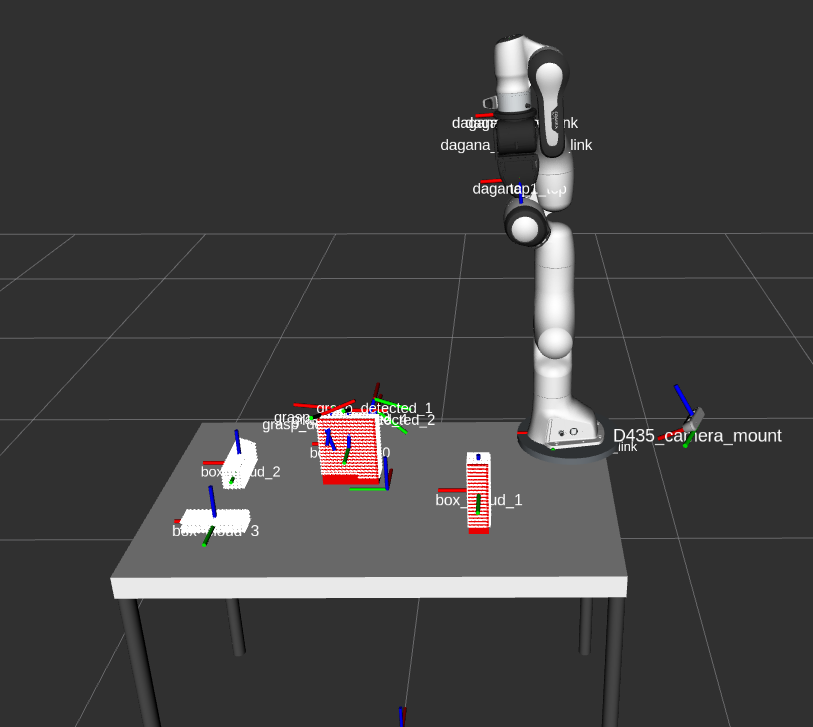
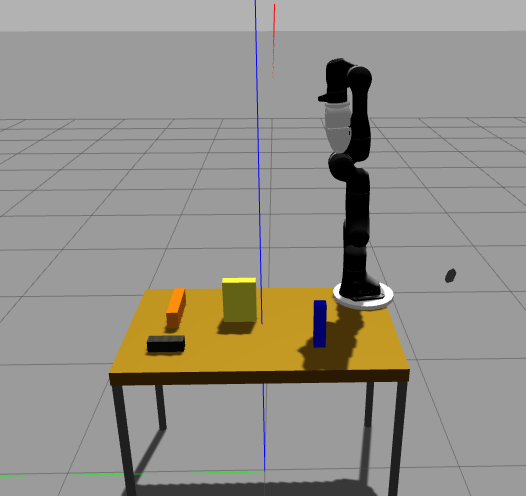

# gpd_ros_wrapper

Wrapper for the grasp pose detection lib (https://github.com/atenpas/gpd) to make it works with ROS (noetic) with some additional features (e.g. point cloud processing)

## Pipeline
camera point cloud -> point cloud filtering -> ExtractGraspPoses -> Grasp Poses  
ExtractGraspPoses is:
1. Get point cloud
2. Extract clusters from point cloud (i.e. blobs of points from the point cloud that represent objects)
3. From a cluster selection, use GPD and publish grasp poses as ROS TF (eventually filtering them according to wanted directions)

## Prerequisite
- ROS noetic and the packages shown in the `package.xml`/`CMakeLists.txt`
- `sudo apt install realsense2_camera realsense_gazebo_description`
- GPD fork at https://github.com/ADVRHumanoids/gpd. Build it with `make` and install it with `make install`
- Point cloud filters, from `sudo apt install ros-noetic-point-cloud2-filters` or source at https://github.com/ADVRHumanoids/point_cloud2_filters. If not using this, you must filter the point cloud by yourself (e.g. removing surfaces like tables) before feeding it to this pipeline to allow the cluster extractor to work properly
- Filter the robot body is also suggested, `sudo apt install ros-noetic-robot-body-filter`

## Install
- Just usual `catkin build` in a ROS-set workspace

## Configuration
- **If used** Set pc_filter config and launch, check `launch/pc_filter.launch` and `conf/pc2_filter_conf.yaml`
- Set GPD config, check examples like `conf/gpd_conf_panda.yaml`. Expecially important to set are the gripper dimensions and the `weights_file` path (which is based to where you cloned the gpd repo)
- Check `extract_grasp_poses.launch` for params 
- **Optional** Compile using `ExtractGraspPoses::run()` instead of `ExtractGraspPoses::run_no_tf_input()` if you want to provide a tf to select the cluster.
  In practice, a cluster will be selected when such tf is inside the cluster.

### Camera Calibration
- If images are bad, params can be given with `<rosparam>` tags as in `d435.launch` file
- Table to camera TF must be provided in someway. Convenience launch for static tranform pub from the table to the camera `mount_camera.launch`
- To find the table to camera pose argument for e.g. the `mount_camera.launch`, one option is `table_cam_calib.launch` file:  
  1. It uses aruco detection: `sudo apt install ros-noetic-aruco-detect`
  2. Prepare table printing an aruco and put it *as much as possible* precisely at the center of the table
  3. Mount camera watching the aruco
  4. `roslaunch gpd_ros_wrapper table_cam_calib.launch`. Check the file for important arguments, like table size, aruco size, aruco dictionary. This uses https://github.com/ADVRHumanoids/iit-gazebo-worlds-pkg.git for the table model.
  6. Aruco should be detected and camera should be visible in RViz. If the camera in RViz is in complete wrong position, consider rotate the Aruco. Also consider to put the camera nearer the aruco if the detection is unstable/bad
  5. Finalize camera position to have the most suitable POV
  6. Get transform with `rosrun tf2_tools surface_top D435_camera_mount -p 5` and store them to use in the `mount_camera.launch` file
  7. Obviously, do not move the camera anymore.
 
## Usage standalone
- Have something publish the tf from the table to the robot (e.g. `mount_robot.launch`)
- Have something publish the tf from the table to the camera (e.g. `mount_camera.launch`)
- Run camera, e.g. `roslaunch gpd_ros_wrapper d435.launch`
- Run pc filters, e.g. `roslaunch gpd_ros_wrapper pc_filter.launch`
- Run the actual extractor, `roslaunch gpd_ros_wrapper extract_grasp_poses.launch publishGraspsTf:=true`  
  With the publishGraspsTf argument, grasp poses are published as tf with child names *grasp_detected_0*, *grasp_detected_1*, *grasp_detected_2* ... (they are in order of GPD score)

### Simulation Complete Example
Terminals:
1. `roslaunch gpd_ros_wrapper franka_gazebo_example.launch`
2. `roslaunch gpd_ros_wrapper pc_filter.launch`
3. `roslaunch gpd_ros_wrapper extract_grasp_poses.launch publishGraspsTf:=true`
TF should be spawned continuosly on the object 0, visible on RViz, with names *grasp_detected_0*, *grasp_detected_1*, *grasp_detected_2*...

## Usage API - advanced
- Include the library, use it as done in the `extract_grasp_poses_executable.cpp` and use methods like `getGraspsPoses()`  

